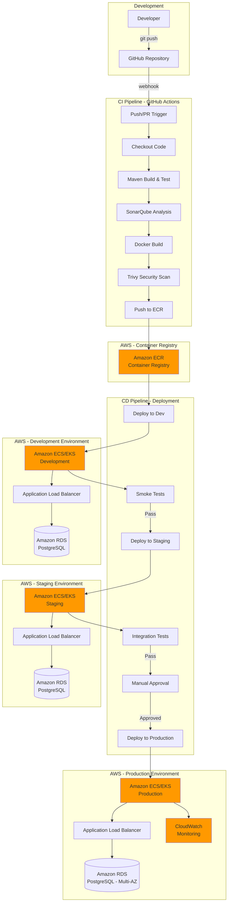
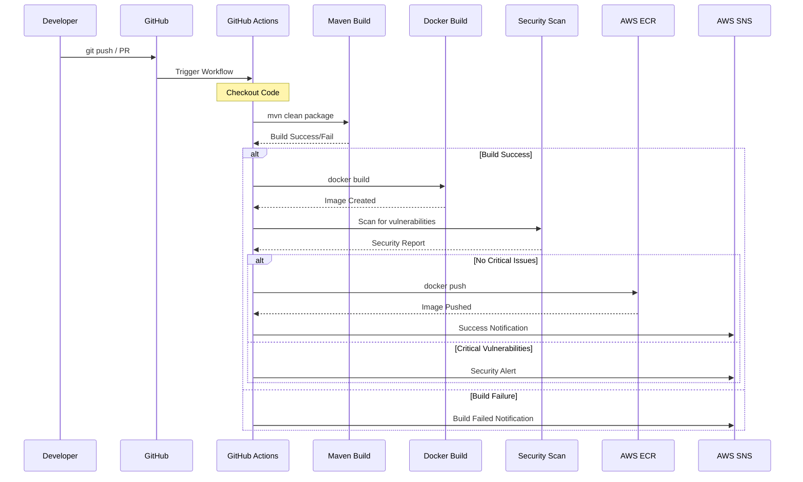
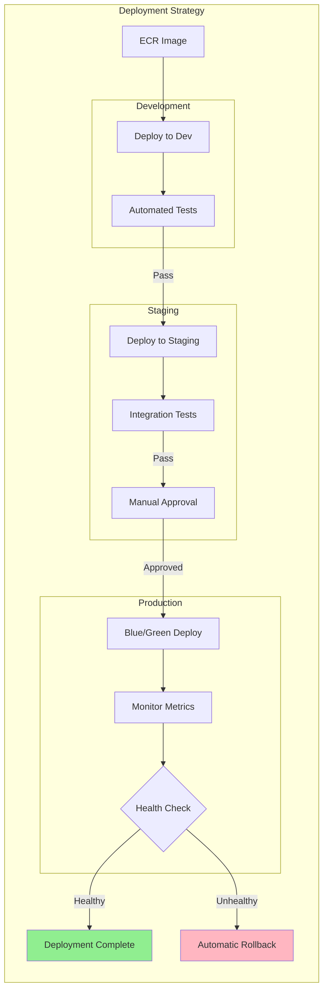
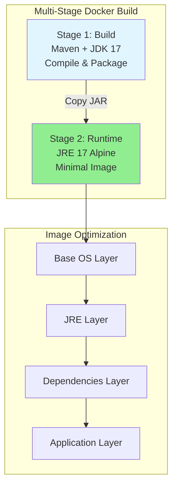
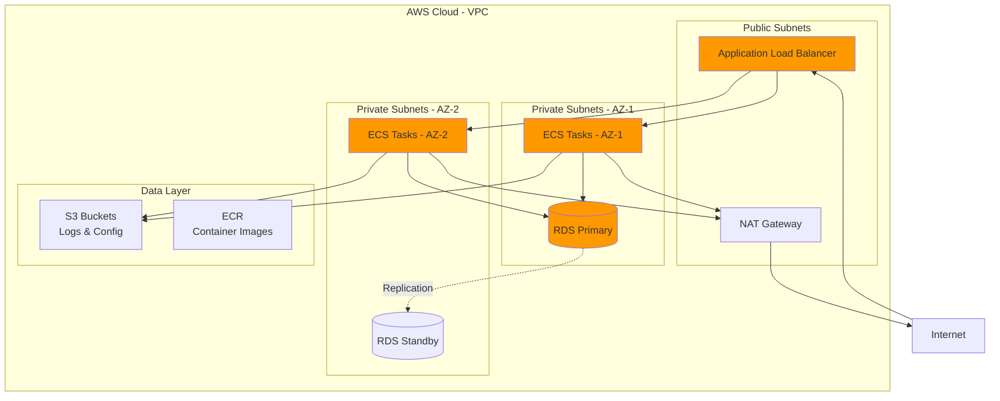
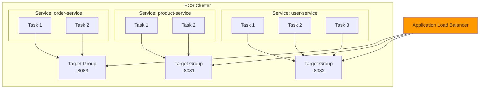
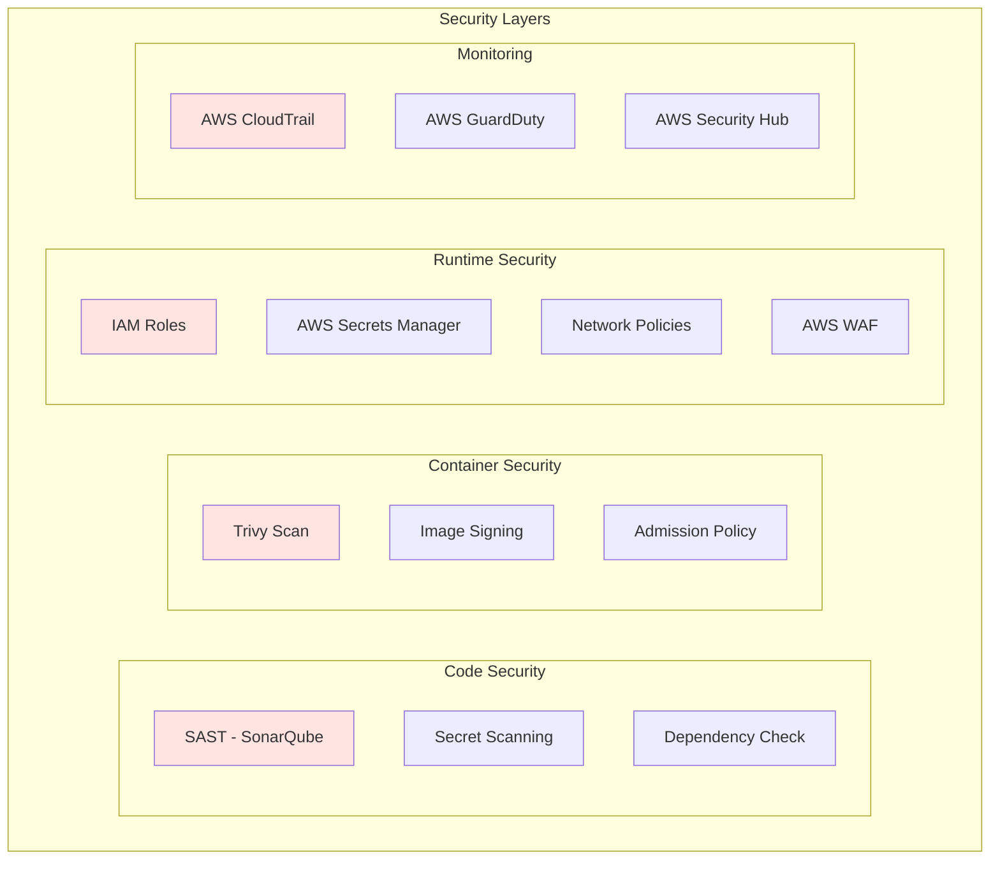
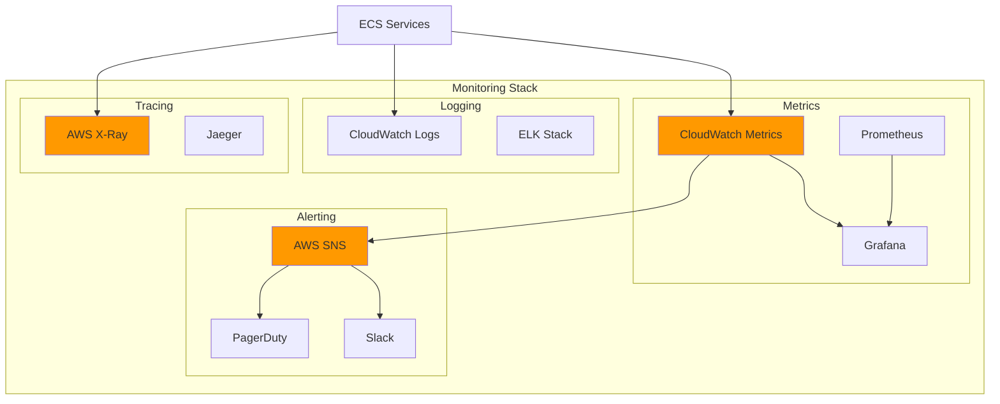

# CI/CD Architecture for Microservices on AWS

## 🏗️ Architecture Overview

This document outlines a comprehensive CI/CD pipeline for deploying the microservices to AWS using Docker containers, ECR (Elastic Container Registry), and various AWS services.

---

## 📊 CI/CD Architecture Diagram



---

## 🔧 Detailed CI/CD Pipeline

### Phase 1: Continuous Integration (CI)



### Phase 2: Continuous Deployment (CD)



---

## 🐳 Docker Strategy

### Multi-Stage Dockerfile Architecture



### Container Image Naming Convention

```
{registry}/{repository}/{service-name}:{tag}

Example:
123456789.dkr.ecr.us-east-1.amazonaws.com/microservices/user-service:v1.2.3
123456789.dkr.ecr.us-east-1.amazonaws.com/microservices/product-service:latest
123456789.dkr.ecr.us-east-1.amazonaws.com/microservices/order-service:dev-20231125
```

---

## 🏢 AWS Infrastructure Architecture

### Network Architecture



### ECS/EKS Service Deployment



---

## 📁 Required Files Structure

```
microservices-and-bddtesting/
├── .github/
│   └── workflows/
│       ├── ci-user-service.yml
│       ├── ci-product-service.yml
│       ├── ci-order-service.yml
│       ├── cd-deploy-dev.yml
│       ├── cd-deploy-staging.yml
│       └── cd-deploy-prod.yml
├── infrastructure/
│   ├── terraform/
│   │   ├── vpc/
│   │   ├── ecr/
│   │   ├── ecs/
│   │   ├── rds/
│   │   └── alb/
│   └── cloudformation/
│       └── (alternative to Terraform)
├── docker/
│   ├── user-service/
│   │   └── Dockerfile
│   ├── product-service/
│   │   └── Dockerfile
│   ├── order-service/
│   │   └── Dockerfile
│   └── api-test/
│       └── Dockerfile
├── kubernetes/
│   ├── dev/
│   ├── staging/
│   └── prod/
├── scripts/
│   ├── build-and-push.sh
│   ├── deploy-ecs.sh
│   └── rollback.sh
└── config/
    ├── application-dev.yml
    ├── application-staging.yml
    └── application-prod.yml
```

---

## 🔐 Security Best Practices



---

## 🚀 Step-by-Step Implementation Guide

### Step 1: Create Dockerfiles for Each Service

**Example: user-service/Dockerfile**
```dockerfile
# Multi-stage build for user-service

# Stage 1: Build
FROM maven:3.9-eclipse-temurin-17 AS builder
WORKDIR /app
COPY pom.xml .
COPY src ./src
RUN mvn clean package -DskipTests

# Stage 2: Runtime
FROM eclipse-temurin:17-jre-alpine
WORKDIR /app

# Create non-root user
RUN addgroup -S spring && adduser -S spring -G spring
USER spring:spring

# Copy JAR from builder
COPY --from=builder /app/target/*.jar app.jar

# Health check
HEALTHCHECK --interval=30s --timeout=3s --start-period=40s --retries=3 \
  CMD wget --quiet --tries=1 --spider http://localhost:8082/actuator/health || exit 1

# Expose port
EXPOSE 8082

# Run application
ENTRYPOINT ["java", \
    "-XX:+UseContainerSupport", \
    "-XX:MaxRAMPercentage=75.0", \
    "-Djava.security.egd=file:/dev/./urandom", \
    "-jar", "app.jar"]
```

### Step 2: Setup AWS ECR Repositories

**Using AWS CLI:**
```bash
# Create ECR repositories for each service
aws ecr create-repository --repository-name microservices/user-service --region us-east-1
aws ecr create-repository --repository-name microservices/product-service --region us-east-1
aws ecr create-repository --repository-name microservices/order-service --region us-east-1
aws ecr create-repository --repository-name microservices/api-test --region us-east-1

# Set lifecycle policy to keep only last 10 images
aws ecr put-lifecycle-policy \
    --repository-name microservices/user-service \
    --lifecycle-policy-text file://ecr-lifecycle-policy.json
```

**ecr-lifecycle-policy.json:**
```json
{
  "rules": [
    {
      "rulePriority": 1,
      "description": "Keep last 10 images",
      "selection": {
        "tagStatus": "any",
        "countType": "imageCountMoreThan",
        "countNumber": 10
      },
      "action": {
        "type": "expire"
      }
    }
  ]
}
```

### Step 3: Create GitHub Actions Workflow

**.github/workflows/ci-cd-user-service.yml:**
```yaml
name: CI/CD - User Service

on:
  push:
    branches: [main, develop]
    paths:
      - 'user-service/**'
      - '.github/workflows/ci-cd-user-service.yml'
  pull_request:
    branches: [main, develop]
    paths:
      - 'user-service/**'

env:
  AWS_REGION: us-east-1
  ECR_REPOSITORY: microservices/user-service
  SERVICE_NAME: user-service
  ECS_CLUSTER: microservices-cluster
  ECS_SERVICE: user-service

jobs:
  build-and-test:
    name: Build and Test
    runs-on: ubuntu-latest
    
    steps:
      - name: Checkout code
        uses: actions/checkout@v4
      
      - name: Set up JDK 17
        uses: actions/setup-java@v4
        with:
          java-version: '17'
          distribution: 'temurin'
          cache: maven
      
      - name: Build with Maven
        working-directory: ./user-service
        run: mvn clean package -DskipTests
      
      - name: Run Unit Tests
        working-directory: ./user-service
        run: mvn test
      
      - name: Run Integration Tests
        working-directory: ./user-service
        run: mvn verify -DskipUnitTests
      
      - name: Generate Test Report
        if: always()
        uses: dorny/test-reporter@v1
        with:
          name: Test Results
          path: user-service/target/surefire-reports/*.xml
          reporter: java-junit
      
      - name: Upload JAR artifact
        uses: actions/upload-artifact@v4
        with:
          name: user-service-jar
          path: user-service/target/*.jar

  code-quality:
    name: Code Quality Analysis
    runs-on: ubuntu-latest
    needs: build-and-test
    
    steps:
      - name: Checkout code
        uses: actions/checkout@v4
      
      - name: Set up JDK 17
        uses: actions/setup-java@v4
        with:
          java-version: '17'
          distribution: 'temurin'
      
      - name: SonarQube Scan
        env:
          SONAR_TOKEN: ${{ secrets.SONAR_TOKEN }}
          SONAR_HOST_URL: ${{ secrets.SONAR_HOST_URL }}
        working-directory: ./user-service
        run: |
          mvn sonar:sonar \
            -Dsonar.projectKey=user-service \
            -Dsonar.host.url=$SONAR_HOST_URL \
            -Dsonar.login=$SONAR_TOKEN

  build-and-push-image:
    name: Build and Push Docker Image
    runs-on: ubuntu-latest
    needs: [build-and-test, code-quality]
    if: github.ref == 'refs/heads/main' || github.ref == 'refs/heads/develop'
    
    outputs:
      image-tag: ${{ steps.meta.outputs.tags }}
    
    steps:
      - name: Checkout code
        uses: actions/checkout@v4
      
      - name: Configure AWS credentials
        uses: aws-actions/configure-aws-credentials@v4
        with:
          aws-access-key-id: ${{ secrets.AWS_ACCESS_KEY_ID }}
          aws-secret-access-key: ${{ secrets.AWS_SECRET_ACCESS_KEY }}
          aws-region: ${{ env.AWS_REGION }}
      
      - name: Login to Amazon ECR
        id: login-ecr
        uses: aws-actions/amazon-ecr-login@v2
      
      - name: Extract metadata
        id: meta
        uses: docker/metadata-action@v5
        with:
          images: ${{ steps.login-ecr.outputs.registry }}/${{ env.ECR_REPOSITORY }}
          tags: |
            type=ref,event=branch
            type=ref,event=pr
            type=semver,pattern={{version}}
            type=semver,pattern={{major}}.{{minor}}
            type=sha,prefix={{branch}}-
      
      - name: Build Docker image
        uses: docker/build-push-action@v5
        with:
          context: ./user-service
          file: ./user-service/Dockerfile
          push: false
          tags: ${{ steps.meta.outputs.tags }}
          labels: ${{ steps.meta.outputs.labels }}
          cache-from: type=gha
          cache-to: type=gha,mode=max
      
      - name: Run Trivy vulnerability scanner
        uses: aquasecurity/trivy-action@master
        with:
          image-ref: ${{ steps.meta.outputs.tags }}
          format: 'sarif'
          output: 'trivy-results.sarif'
      
      - name: Upload Trivy results to GitHub Security
        uses: github/codeql-action/upload-sarif@v3
        if: always()
        with:
          sarif_file: 'trivy-results.sarif'
      
      - name: Push Docker image to ECR
        uses: docker/build-push-action@v5
        with:
          context: ./user-service
          file: ./user-service/Dockerfile
          push: true
          tags: ${{ steps.meta.outputs.tags }}
          labels: ${{ steps.meta.outputs.labels }}

  deploy-dev:
    name: Deploy to Development
    runs-on: ubuntu-latest
    needs: build-and-push-image
    if: github.ref == 'refs/heads/develop'
    environment:
      name: development
      url: https://dev.api.example.com/user-service
    
    steps:
      - name: Configure AWS credentials
        uses: aws-actions/configure-aws-credentials@v4
        with:
          aws-access-key-id: ${{ secrets.AWS_ACCESS_KEY_ID }}
          aws-secret-access-key: ${{ secrets.AWS_SECRET_ACCESS_KEY }}
          aws-region: ${{ env.AWS_REGION }}
      
      - name: Update ECS Service
        run: |
          aws ecs update-service \
            --cluster ${{ env.ECS_CLUSTER }}-dev \
            --service ${{ env.ECS_SERVICE }}-dev \
            --force-new-deployment \
            --region ${{ env.AWS_REGION }}
      
      - name: Wait for deployment
        run: |
          aws ecs wait services-stable \
            --cluster ${{ env.ECS_CLUSTER }}-dev \
            --services ${{ env.ECS_SERVICE }}-dev \
            --region ${{ env.AWS_REGION }}
      
      - name: Run smoke tests
        run: |
          curl -f https://dev.api.example.com/user-service/actuator/health || exit 1

  deploy-staging:
    name: Deploy to Staging
    runs-on: ubuntu-latest
    needs: deploy-dev
    if: github.ref == 'refs/heads/develop'
    environment:
      name: staging
      url: https://staging.api.example.com/user-service
    
    steps:
      - name: Configure AWS credentials
        uses: aws-actions/configure-aws-credentials@v4
        with:
          aws-access-key-id: ${{ secrets.AWS_ACCESS_KEY_ID }}
          aws-secret-access-key: ${{ secrets.AWS_SECRET_ACCESS_KEY }}
          aws-region: ${{ env.AWS_REGION }}
      
      - name: Update ECS Service
        run: |
          aws ecs update-service \
            --cluster ${{ env.ECS_CLUSTER }}-staging \
            --service ${{ env.ECS_SERVICE }}-staging \
            --force-new-deployment \
            --region ${{ env.AWS_REGION }}
      
      - name: Wait for deployment
        run: |
          aws ecs wait services-stable \
            --cluster ${{ env.ECS_CLUSTER }}-staging \
            --services ${{ env.ECS_SERVICE }}-staging \
            --region ${{ env.AWS_REGION }}

  deploy-production:
    name: Deploy to Production
    runs-on: ubuntu-latest
    needs: build-and-push-image
    if: github.ref == 'refs/heads/main'
    environment:
      name: production
      url: https://api.example.com/user-service
    
    steps:
      - name: Configure AWS credentials
        uses: aws-actions/configure-aws-credentials@v4
        with:
          aws-access-key-id: ${{ secrets.AWS_ACCESS_KEY_ID }}
          aws-secret-access-key: ${{ secrets.AWS_SECRET_ACCESS_KEY }}
          aws-region: ${{ env.AWS_REGION }}
      
      - name: Blue/Green Deployment
        run: |
          # Create new task definition revision
          aws ecs register-task-definition \
            --cli-input-json file://task-definition.json
          
          # Update service with new task definition
          aws ecs update-service \
            --cluster ${{ env.ECS_CLUSTER }}-prod \
            --service ${{ env.ECS_SERVICE }}-prod \
            --task-definition ${{ env.SERVICE_NAME }}-prod:${{ needs.build-and-push-image.outputs.image-tag }} \
            --deployment-configuration "maximumPercent=200,minimumHealthyPercent=100" \
            --region ${{ env.AWS_REGION }}
      
      - name: Monitor deployment
        run: |
          aws ecs wait services-stable \
            --cluster ${{ env.ECS_CLUSTER }}-prod \
            --services ${{ env.ECS_SERVICE }}-prod \
            --region ${{ env.AWS_REGION }}
      
      - name: Run production health checks
        run: |
          for i in {1..5}; do
            if curl -f https://api.example.com/user-service/actuator/health; then
              echo "Health check passed"
              exit 0
            fi
            sleep 10
          done
          echo "Health check failed"
          exit 1
      
      - name: Send deployment notification
        uses: 8398a7/action-slack@v3
        if: always()
        with:
          status: ${{ job.status }}
          text: 'Production deployment ${{ job.status }}'
          webhook_url: ${{ secrets.SLACK_WEBHOOK }}
```

### Step 4: Create Terraform Infrastructure

**infrastructure/terraform/main.tf:**
```hcl
# Main Terraform configuration
terraform {
  required_version = ">= 1.5"
  
  required_providers {
    aws = {
      source  = "hashicorp/aws"
      version = "~> 5.0"
    }
  }
  
  backend "s3" {
    bucket         = "my-terraform-state"
    key            = "microservices/terraform.tfstate"
    region         = "us-east-1"
    encrypt        = true
    dynamodb_table = "terraform-lock"
  }
}

provider "aws" {
  region = var.aws_region
}

# VPC Module
module "vpc" {
  source = "./modules/vpc"
  
  environment = var.environment
  vpc_cidr    = var.vpc_cidr
}

# ECR Module
module "ecr" {
  source = "./modules/ecr"
  
  services = [
    "user-service",
    "product-service",
    "order-service",
    "api-test"
  ]
}

# ECS Cluster Module
module "ecs" {
  source = "./modules/ecs"
  
  environment    = var.environment
  vpc_id         = module.vpc.vpc_id
  private_subnets = module.vpc.private_subnets
  
  services = {
    user-service = {
      port           = 8082
      desired_count  = 3
      cpu            = 512
      memory         = 1024
      health_check_path = "/actuator/health"
    }
    product-service = {
      port           = 8081
      desired_count  = 2
      cpu            = 512
      memory         = 1024
      health_check_path = "/actuator/health"
    }
    order-service = {
      port           = 8083
      desired_count  = 2
      cpu            = 512
      memory         = 1024
      health_check_path = "/actuator/health"
    }
  }
}

# RDS Module
module "rds" {
  source = "./modules/rds"
  
  environment     = var.environment
  vpc_id          = module.vpc.vpc_id
  private_subnets = module.vpc.private_subnets
  multi_az        = var.environment == "prod" ? true : false
}

# ALB Module
module "alb" {
  source = "./modules/alb"
  
  environment    = var.environment
  vpc_id         = module.vpc.vpc_id
  public_subnets = module.vpc.public_subnets
  certificate_arn = var.certificate_arn
}
```

### Step 5: Monitoring and Observability

**CloudWatch Configuration:**
```yaml
# cloudwatch-config.yml
metrics:
  - namespace: Microservices/UserService
    metrics:
      - name: CPUUtilization
        threshold: 80
        alarm_action: scale_up
      - name: MemoryUtilization
        threshold: 85
        alarm_action: scale_up
      - name: RequestCount
        threshold: 1000
        period: 60
      - name: TargetResponseTime
        threshold: 500
        unit: Milliseconds

logs:
  - log_group: /ecs/user-service
    retention_days: 30
    insights_queries:
      - name: error-rate
        query: |
          fields @timestamp, @message
          | filter @message like /ERROR/
          | stats count() by bin(5m)
```

---

## 💰 Cost Estimation

### Monthly AWS Cost Breakdown (Development Environment)

| Service | Configuration | Monthly Cost (USD) |
|---------|--------------|-------------------|
| **ECS Fargate** | 3 services × 2 tasks × 24/7 | ~$180 |
| **Application Load Balancer** | 1 ALB | ~$20 |
| **RDS PostgreSQL** | db.t3.medium (Multi-AZ: No) | ~$60 |
| **ECR** | 50 GB storage | ~$5 |
| **CloudWatch Logs** | 10 GB/month | ~$5 |
| **CloudWatch Metrics** | Custom metrics | ~$10 |
| **Data Transfer** | 100 GB/month | ~$9 |
| **NAT Gateway** | 1 gateway | ~$45 |
| **Route 53** | Hosted zone | ~$0.50 |
| **Secrets Manager** | 10 secrets | ~$4 |
| **CloudFront** | Optional CDN | ~$10 |
| **Total** | | **~$348.50/month** |

### Production Environment Cost (Estimated)

- **ECS Fargate**: 3 services × 6 tasks (HA) = ~$540/month
- **RDS Multi-AZ**: db.t3.large = ~$240/month
- **Multi-AZ NAT Gateways**: 2 gateways = ~$90/month
- **Enhanced monitoring & backups**: ~$50/month
- **Total Production**: **~$1,200-1,500/month**

---

## 📋 Implementation Checklist

### Pre-requisites
- [ ] AWS Account setup
- [ ] GitHub repository access
- [ ] AWS CLI installed and configured
- [ ] Terraform installed
- [ ] Docker installed locally

### Phase 1: Foundation (Week 1)
- [ ] Create Dockerfiles for all services
- [ ] Test Docker builds locally
- [ ] Setup AWS ECR repositories
- [ ] Push initial images to ECR
- [ ] Create base Terraform modules

### Phase 2: CI Pipeline (Week 2)
- [ ] Create GitHub Actions workflows
- [ ] Setup SonarQube integration
- [ ] Configure Trivy security scanning
- [ ] Implement automated testing
- [ ] Setup notification system

### Phase 3: Infrastructure (Week 2-3)
- [ ] Deploy VPC and networking
- [ ] Setup ECS cluster
- [ ] Configure Application Load Balancer
- [ ] Deploy RDS databases
- [ ] Setup CloudWatch monitoring

### Phase 4: CD Pipeline (Week 3-4)
- [ ] Implement dev deployment
- [ ] Implement staging deployment
- [ ] Implement production deployment
- [ ] Setup blue/green deployments
- [ ] Configure auto-rollback

### Phase 5: Testing & Optimization (Week 4)
- [ ] End-to-end testing
- [ ] Performance testing
- [ ] Security audit
- [ ] Cost optimization
- [ ] Documentation

---

## 🔍 Monitoring Dashboard



---

## 📚 Additional Resources

### Documentation Links
- [AWS ECS Best Practices](https://docs.aws.amazon.com/AmazonECS/latest/bestpracticesguide/)
- [GitHub Actions for AWS](https://github.com/aws-actions)
- [Terraform AWS Provider](https://registry.terraform.io/providers/hashicorp/aws/latest/docs)
- [Docker Multi-Stage Builds](https://docs.docker.com/build/building/multi-stage/)
- [AWS Well-Architected Framework](https://aws.amazon.com/architecture/well-architected/)

### Tools & Services
- **CI/CD**: GitHub Actions, AWS CodePipeline, Jenkins
- **Container Orchestration**: Amazon ECS, Amazon EKS
- **Monitoring**: CloudWatch, Prometheus, Grafana
- **Security**: Trivy, Snyk, AWS Security Hub
- **IaC**: Terraform, CloudFormation, AWS CDK

---

## 🎯 Next Steps

1. **Start with Development Environment**
   - Create Dockerfiles
   - Setup ECR
   - Deploy to ECS development cluster

2. **Implement Basic CI Pipeline**
   - GitHub Actions for build
   - Automated testing
   - Push to ECR

3. **Add CD Pipeline**
   - Deploy to development automatically
   - Manual approval for staging
   - Blue/green deployment for production

4. **Enhance with Monitoring**
   - CloudWatch dashboards
   - Custom metrics
   - Alerting setup

5. **Optimize and Scale**
   - Auto-scaling configuration
   - Cost optimization
   - Performance tuning

---

**Author**: Krishan Shukla  
**Date**: November 2025  
**Version**: 1.0
