# Pact Contract Testing Implementation Progress

## 🎯 Implementation Status: 40% Complete (4/10 Steps)

---

## ✅ **Completed Steps**

### **Step 1: Pact Broker Infrastructure Setup** ✅
**Status**: Files created, ready to launch

**What was created:**
1. **docker-compose-pact.yml** - Docker infrastructure
   - PostgreSQL 15-alpine (port 5432)
   - Pact Broker (port 9292)
   - Health checks configured
   - Persistent volumes for data

2. **pact-broker.sh** - Management script (executable)
   - `./pact-broker.sh start` - Launch services
   - `./pact-broker.sh stop` - Stop services
   - `./pact-broker.sh status` - Check health
   - `./pact-broker.sh logs` - View logs
   - `./pact-broker.sh ui` - Open web interface
   - `./pact-broker.sh clean` - Remove all data
   - `./pact-broker.sh restart` - Restart services

**Next action**: Start broker with `./pact-broker.sh start`

---

### **Step 2: Add Pact Dependencies to order-service** ✅
**Status**: Fully integrated and compiled

**Dependencies added to** `order-service/pom.xml`:
```xml
<properties>
    <pact.version>4.6.3</pact.version>
</properties>

<dependencies>
    <!-- Consumer testing - write consumer tests -->
    <dependency>
        <groupId>au.com.dius.pact.consumer</groupId>
        <artifactId>junit5</artifactId>
        <version>${pact.version}</version>
        <scope>test</scope>
    </dependency>
    
    <!-- Provider verification - verify as provider -->
    <dependency>
        <groupId>au.com.dius.pact.provider</groupId>
        <artifactId>junit5spring</artifactId>
        <version>${pact.version}</version>
        <scope>test</scope>
    </dependency>
    
    <!-- Core models - Pact data structures -->
    <dependency>
        <groupId>au.com.dius.pact.core</groupId>
        <artifactId>model</artifactId>
        <version>${pact.version}</version>
    </dependency>
</dependencies>

<build>
    <plugins>
        <!-- Pact Maven plugin for publishing -->
        <plugin>
            <groupId>au.com.dius.pact.provider</groupId>
            <artifactId>maven</artifactId>
            <version>${pact.version}</version>
            <configuration>
                <pactBrokerUrl>http://localhost:9292</pactBrokerUrl>
                <pactBrokerUsername>pactbroker</pactBrokerUsername>
                <pactBrokerPassword>pactbroker</pactBrokerPassword>
                <pactDirectory>target/pacts</pactDirectory>
                <projectVersion>${project.version}</projectVersion>
                <tags>
                    <tag>dev</tag>
                </tags>
            </configuration>
        </plugin>
    </plugins>
</build>
```

**Verification**: Compiled successfully with all 100+ transitive dependencies downloaded

---

### **Step 3: Create First Consumer Test** ✅
**Status**: Fully implemented with extensive documentation

**File created**: `order-service/src/test/java/com/microservices/order/contract/consumer/UserServiceConsumerPactTest.java`

**What it does**:
- Defines Order Service's expectations from User Service
- Creates contracts WITHOUT needing real User Service running
- Uses mock servers on dynamic ports

**Test cases implemented**:

#### **Test Case 1: Success Scenario** ✅
```java
@Pact(consumer = "order-service", provider = "user-service")
public V4Pact getUserByIdPact(PactDslWithProvider builder) {
    // Provider State: "user with id 1 exists"
    // Request: GET /api/v1/users/1
    // Expected Response: 200 OK with user data
}
```
- **Request**: `GET /api/v1/users/1`
- **Provider State**: "user with id 1 exists"
- **Expected Response**: 200 OK
- **Response Body**:
  ```json
  {
    "id": "1",
    "name": "John Doe",
    "email": "john@example.com",
    "status": "ACTIVE",
    "createdAt": "2024-01-01T10:00:00"
  }
  ```
- **Matching Rules**: Type-based matching (allows different values, same structure)

#### **Test Case 2: Error Scenario** ✅
```java
@Pact(consumer = "order-service", provider = "user-service")
public V4Pact getUserNotFoundPact(PactDslWithProvider builder) {
    // Provider State: "user with id 999 does not exist"
    // Request: GET /api/v1/users/999
    // Expected Response: 404 NOT FOUND
}
```
- **Request**: `GET /api/v1/users/999`
- **Provider State**: "user with id 999 does not exist"
- **Expected Response**: 404 NOT FOUND
- **Error Handling**: Verifies Order Service handles 404 gracefully

**Code features**:
- 206 lines with extensive inline comments
- Demonstrates PactDslJsonBody for flexible matching
- Shows provider state usage
- Validates both success and error paths

---

### **Step 4: Run Consumer Test and Generate Pact File** ✅
**Status**: ALL TESTS PASSED ✅

**Command executed**:
```bash
cd order-service
mvn clean test -Dtest=UserServiceConsumerPactTest
```

**Test execution results**:
```
Tests run: 2
Failures: 0
Errors: 0
Skipped: 0
Time elapsed: 7.708 seconds

✅ testGetUserById_shouldReturnUserDetails - PASSED
   - Mock server started on port 58828
   - Response: 200 OK with user data
   - All assertions passed

✅ testGetUserById_shouldReturn404ForNonExistentUser - PASSED
   - Mock server started on port 58832
   - Response: 404 NOT FOUND as expected
   - Error handling verified

BUILD SUCCESS
Total time: 22.010 seconds
```

**Generated artifact**:
📄 **target/pacts/order-service-user-service.json**

This Pact file contains:
- Consumer: order-service
- Provider: user-service
- 2 interactions:
  1. Success case (GET /api/v1/users/1 → 200)
  2. Error case (GET /api/v1/users/999 → 404)
- Matching rules for flexible validation
- Provider states required for testing

**What this proves**:
- ✅ Pact framework correctly integrated
- ✅ Consumer tests work without provider running
- ✅ Mock servers function properly
- ✅ Contract generation successful
- ✅ Both success and error paths validated

---

## ⏳ **Remaining Steps (5-10)**

### **Step 5: Start Pact Broker and Publish Contract** [NEXT]
**Goal**: Upload contract to Pact Broker for sharing

**Commands to run**:
```bash
# 1. Start Pact Broker infrastructure
./pact-broker.sh start

# Expected output:
# ✅ Pact Broker is ready!
# 📍 Broker URL: http://localhost:9292
# 🔑 Username: pactbroker
# 🔑 Password: pactbroker

# 2. Publish the generated contract
cd order-service
mvn pact:publish

# Expected output:
# Publishing order-service-user-service.json ... OK
# Published pact: order-service → user-service (v1.0)
```

**What will happen**:
- Docker will start PostgreSQL and Pact Broker
- Pact file uploaded to broker
- Contract visible in UI at http://localhost:9292
- Available for provider verification

---

### **Step 6: Add Pact Dependencies to user-service** [PENDING]
**Goal**: Prepare User Service for provider verification

**Action needed**:
Modify `user-service/pom.xml` to add:
```xml
<properties>
    <pact.version>4.6.3</pact.version>
</properties>

<dependencies>
    <!-- Provider verification - verify against contracts -->
    <dependency>
        <groupId>au.com.dius.pact.provider</groupId>
        <artifactId>junit5spring</artifactId>
        <version>${pact.version}</version>
        <scope>test</scope>
    </dependency>
</dependencies>
```

**Note**: User Service doesn't need consumer dependencies (it's only a provider)

---

### **Step 7: Create Provider Verification Test in user-service** [PENDING]
**Goal**: Verify User Service meets Order Service's expectations

**File to create**: `user-service/src/test/java/com/microservices/user/contract/provider/UserServiceProviderPactTest.java`

**What it will do**:
- Fetch contracts from Pact Broker
- Replay requests against real User Service
- Verify responses match consumer expectations
- Handle provider states (mock data setup)

**Example structure**:
```java
@ExtendWith(SpringExtension.class)
@SpringBootTest(webEnvironment = SpringBootTest.WebEnvironment.RANDOM_PORT)
@Provider("user-service")
@PactBroker(host = "localhost", port = "9292", 
           authentication = @PactBrokerAuth(username = "pactbroker", 
                                           password = "pactbroker"))
public class UserServiceProviderPactTest {
    
    @LocalServerPort
    private int port;
    
    @BeforeEach
    void setup(PactVerificationContext context) {
        context.setTarget(new HttpTestTarget("localhost", port));
    }
    
    @TestTemplate
    @ExtendWith(PactVerificationInvocationContextProvider.class)
    void pactVerificationTestTemplate(PactVerificationContext context) {
        context.verifyInteraction();
    }
    
    @State("user with id 1 exists")
    void userWithId1Exists() {
        // Mock UserRepository to return user with ID 1
        // This ensures the test data matches what contract expects
    }
    
    @State("user with id 999 does not exist")
    void userWithId999DoesNotExist() {
        // Mock UserRepository to return empty for ID 999
    }
}
```

---

### **Step 8: Run Provider Verification** [PENDING]
**Goal**: Verify User Service implementation against contract

**Command to run**:
```bash
cd user-service
mvn test -Dtest=UserServiceProviderPactTest
```

**Expected flow**:
1. Test fetches contract from Pact Broker
2. Sets up provider state ("user with id 1 exists")
3. Replays GET /api/v1/users/1 against real controller
4. Validates response matches contract expectations
5. Repeats for all interactions (including 404 case)
6. Publishes verification results back to broker

**Success criteria**:
- ✅ All interactions verified successfully
- ✅ Response structure matches contract
- ✅ Verification results published to broker

---

### **Step 9: View Results in Pact Broker UI** [PENDING]
**Goal**: Visualize contract relationships and verification status

**Actions**:
```bash
# Open Pact Broker UI
./pact-broker.sh ui

# Or manually open:
open http://localhost:9292
```

**What you'll see**:
- **Contract Matrix**: Shows all consumer-provider relationships
- **order-service → user-service**: Green checkmark (verified)
- **Pact Details**: View contract JSON, matching rules, interactions
- **Verification History**: Track verification over time
- **Can I Deploy**: Check if services can be safely deployed

**Example Matrix View**:
```
┌──────────────────┬──────────────────┬───────────┬────────────┐
│ Consumer         │ Provider         │ Version   │ Status     │
├──────────────────┼──────────────────┼───────────┼────────────┤
│ order-service    │ user-service     │ v1.0      │ ✅ Verified │
│                  │                  │           │ (passed)   │
└──────────────────┴──────────────────┴───────────┴────────────┘
```

---

### **Step 10: Add Second Consumer Test for Product Service** [PENDING]
**Goal**: Demonstrate pattern replication with different provider

**File to create**: `order-service/src/test/java/com/microservices/order/contract/consumer/ProductServiceConsumerPactTest.java`

**Test cases to add**:
1. **Get product by ID** (success)
   - Request: `GET /api/v1/products/1`
   - Response: 200 OK with product data

2. **Check product stock** (success)
   - Request: `GET /api/v1/products/1/stock`
   - Response: 200 OK with stock quantity

3. **Product not found** (error)
   - Request: `GET /api/v1/products/999`
   - Response: 404 NOT FOUND

**Why this matters**:
- Shows contract testing scales across multiple providers
- Order Service has contracts with 2 different services
- Demonstrates real-world microservices scenario
- Each provider verified independently

---

## 🎓 **What We've Learned So Far**

### **Key Concepts Proven**:

#### 1. **Independent Testing** ✅
- Consumer tests run WITHOUT provider running
- Mock servers simulate provider responses
- Faster feedback (no waiting for other teams)

#### 2. **Contract Generation** ✅
- Tests automatically generate JSON contracts
- Contracts serve as documentation
- Single source of truth for expectations

#### 3. **Type-Based Matching** ✅
- Flexible validation (structure, not exact values)
- Example: `stringType("name", "John Doe")` accepts ANY string
- Allows providers to change data without breaking contracts

#### 4. **Provider States** ✅
- Define preconditions for tests
- Example: "user with id 1 exists"
- Providers implement state setup in their tests

#### 5. **Error Handling** ✅
- Contracts cover both success AND error cases
- Validates 404, 500, validation errors
- Ensures consistent error responses

---

## 📊 **Visual Progress**

```
Step 1: Infrastructure     ████████████████████ 100% ✅
Step 2: Dependencies        ████████████████████ 100% ✅
Step 3: Consumer Test       ████████████████████ 100% ✅
Step 4: Test Execution      ████████████████████ 100% ✅
Step 5: Publish Contract    ░░░░░░░░░░░░░░░░░░░░   0% ⏳
Step 6: Provider Deps       ░░░░░░░░░░░░░░░░░░░░   0% ⏳
Step 7: Provider Test       ░░░░░░░░░░░░░░░░░░░░   0% ⏳
Step 8: Verification        ░░░░░░░░░░░░░░░░░░░░   0% ⏳
Step 9: View Results        ░░░░░░░░░░░░░░░░░░░░   0% ⏳
Step 10: Product Service    ░░░░░░░░░░░░░░░░░░░░   0% ⏳

Overall Progress:           ████████░░░░░░░░░░░░  40%
```

---

## 🔄 **Full Workflow (When Complete)**

```mermaid
graph TB
    subgraph "CONSUMER SIDE (Order Service)"
        A[Write Consumer Test] --> B[Run mvn test]
        B --> C[Generate Pact File]
        C --> D[Publish to Broker]
    end
    
    subgraph "PACT BROKER"
        D --> E[Store Contract]
        E --> F[Make Available to Provider]
    end
    
    subgraph "PROVIDER SIDE (User Service)"
        F --> G[Fetch Contract from Broker]
        G --> H[Run Provider Test]
        H --> I[Verify Against Real API]
        I --> J[Publish Verification Result]
    end
    
    J --> K{All Verified?}
    K -->|Yes| L[✅ Safe to Deploy]
    K -->|No| M[❌ Breaking Changes Detected]
    
    style L fill:#90EE90
    style M fill:#FFB6C6
```



---

## 📁 **Files Created This Session**

### **Documentation**:
- ✅ `PACT_CONTRACT_TESTING.md` - Comprehensive guide (7 diagrams, examples)
- ✅ `PACT_IMPLEMENTATION_PROGRESS.md` - This file

### **Infrastructure**:
- ✅ `docker-compose-pact.yml` - PostgreSQL + Pact Broker
- ✅ `pact-broker.sh` - Management script (8 commands)

### **Code**:
- ✅ `order-service/pom.xml` - Modified with Pact dependencies
- ✅ `order-service/src/test/java/.../UserServiceConsumerPactTest.java` - Consumer test (206 lines)

### **Generated Artifacts**:
- ✅ `order-service/target/pacts/order-service-user-service.json` - Contract file

---

## 🎯 **Next Immediate Actions**

When ready to continue:

### **Option 1: Complete Steps 5-9 (Full Workflow)**
```bash
# 1. Start Pact Broker
./pact-broker.sh start

# 2. Publish contract
cd order-service && mvn pact:publish

# 3. Add dependencies to user-service
# (modify user-service/pom.xml)

# 4. Create provider test in user-service
# (write UserServiceProviderPactTest.java)

# 5. Run provider verification
cd user-service && mvn test -Dtest=UserServiceProviderPactTest

# 6. View results
./pact-broker.sh ui
```

### **Option 2: Test Docker Setup First**
```bash
# Verify Docker is working
docker --version
docker compose version
docker ps

# Test Pact Broker startup
./pact-broker.sh start
./pact-broker.sh status
./pact-broker.sh logs

# Check health
curl http://localhost:9292/diagnostic/status/heartbeat
```

### **Option 3: Review What We Have**
```bash
# View generated contract
cat order-service/target/pacts/order-service-user-service.json | jq

# Re-run consumer test to see output
cd order-service && mvn test -Dtest=UserServiceConsumerPactTest

# Check test coverage
find . -name "*Pact*.java"
```

---

## 📚 **Reference Commands**

### **Pact Broker Management**:
```bash
./pact-broker.sh start     # Start infrastructure
./pact-broker.sh stop      # Stop infrastructure
./pact-broker.sh restart   # Restart services
./pact-broker.sh status    # Check health
./pact-broker.sh logs      # View logs
./pact-broker.sh ui        # Open web interface
./pact-broker.sh clean     # Remove all data
./pact-broker.sh help      # Show help
```

### **Maven Commands**:
```bash
# Run consumer tests
mvn test -Dtest=UserServiceConsumerPactTest

# Publish contracts
mvn pact:publish

# Run provider verification
mvn test -Dtest=UserServiceProviderPactTest

# Run all tests
mvn test

# Clean build
mvn clean install
```

### **Docker Commands**:
```bash
# Check running containers
docker ps

# View Pact containers
docker ps --filter "name=pact"

# View logs
docker logs pact-broker
docker logs postgres

# Remove everything
docker compose -f docker-compose-pact.yml down -v
```

---

## ✨ **Key Achievements**

1. ✅ **Integrated Pact Framework**: Successfully added and compiled Pact 4.6.3
2. ✅ **Created Working Test**: 2/2 test cases passing on first run
3. ✅ **Generated Contract**: Valid JSON contract file created
4. ✅ **Demonstrated Independence**: Tests work without User Service running
5. ✅ **Validated Both Paths**: Success (200) and error (404) scenarios covered
6. ✅ **Comprehensive Documentation**: Guide with diagrams and examples
7. ✅ **Infrastructure Ready**: Docker setup prepared for broker
8. ✅ **Management Tools**: Shell script for easy broker management

---

## 🤝 **What This Enables**

### **For Development**:
- Parallel development (teams don't wait for each other)
- Faster feedback (test consumer without provider)
- Clear expectations (contract as documentation)

### **For Testing**:
- Independent test execution
- Consistent error handling validation
- Coverage of success AND failure paths

### **For Deployment**:
- Safe deployment checks (can-i-deploy)
- Version compatibility validation
- Breaking change detection

### **For Maintenance**:
- Visual relationship mapping
- Historical verification tracking
- Automated regression testing

---

## 📞 **Questions to Consider**

As we move to Steps 5-10:

1. **Broker Strategy**:
   - Use local broker (localhost:9292) or hosted solution?
   - How to handle broker credentials in CI/CD?

2. **Provider States**:
   - Mock data in tests or use test database?
   - How to manage state cleanup between tests?

3. **CI/CD Integration**:
   - When to run consumer tests? (on every commit?)
   - When to verify providers? (on schedule? on-demand?)
   - How to prevent breaking deployments?

4. **Versioning**:
   - Semantic versioning for contracts?
   - How to handle multiple versions in production?

5. **Team Workflow**:
   - Who owns contract updates?
   - How to communicate breaking changes?
   - Process for contract reviews?

---

## 🎉 **Summary**

**We've successfully implemented the foundation of Pact contract testing!**

The Order Service now:
- ✅ Has working consumer tests
- ✅ Generates contracts automatically
- ✅ Tests independent of User Service
- ✅ Validates success and error scenarios
- ✅ Uses flexible type-based matching
- ✅ Ready to publish to Pact Broker

**Next milestone**: Complete the provider side (Steps 5-8) to demonstrate full consumer-provider workflow with verification and visual results in Pact Broker UI.

---

*Last updated: After Step 4 completion*
*Commit: 22c38bd - "Implement Pact contract testing for Order Service"*
*Branch: main*
