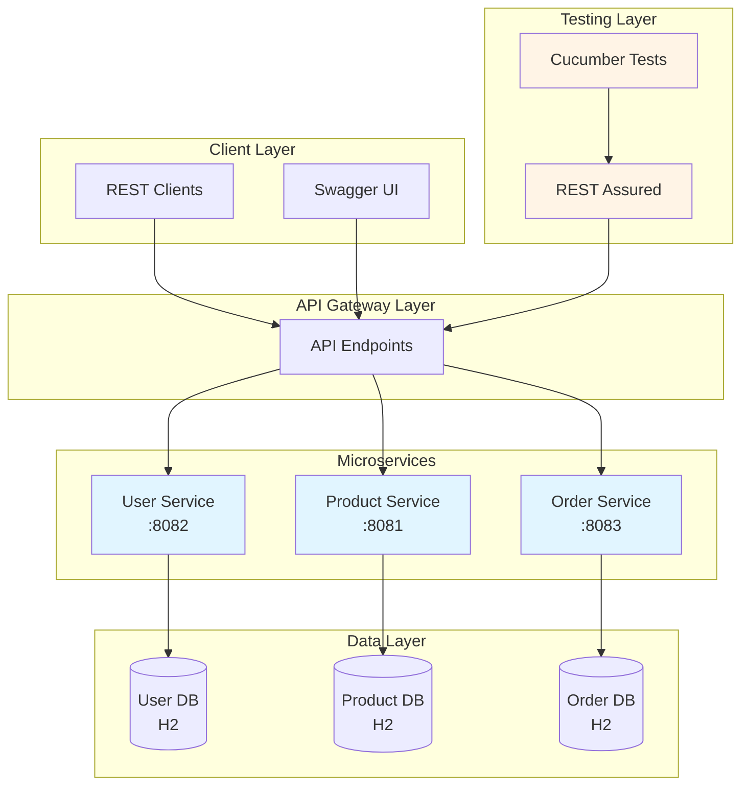
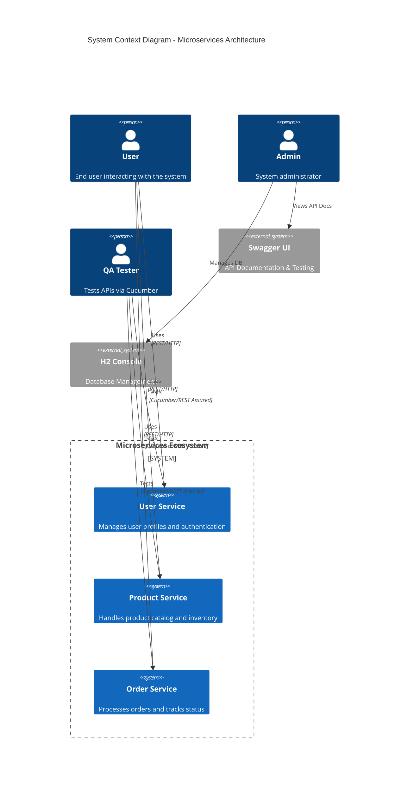
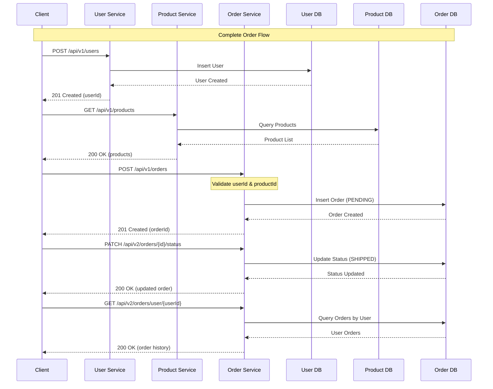
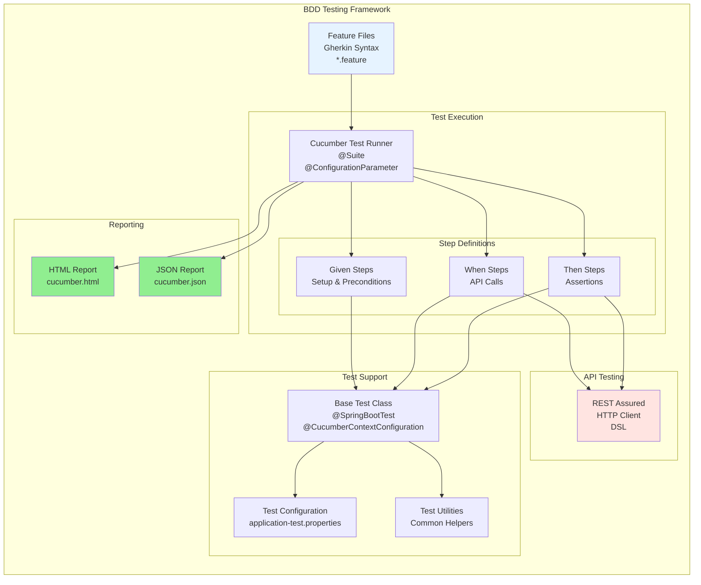
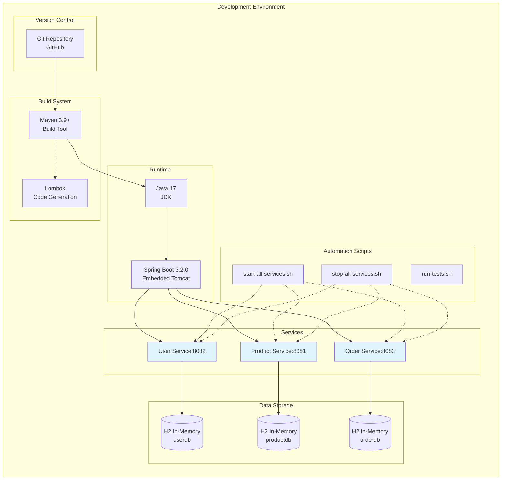
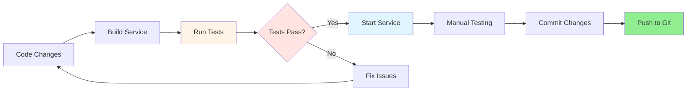

# 🚀 Spring Boot Microservices with BDD Testing

[](https://www.oracle.com/java/)
[](https://spring.io/projects/spring-boot)
[](https://cucumber.io/)
[](https://rest-assured.io/)

A comprehensive microservices architecture implementation with Spring Boot, featuring dual API versioning (v1/v2), BDD testing with Cucumber, and complete REST API automation.

## � Table of Contents

- [Architecture Overview](#-architecture-overview)
- [Microservices](#-microservices)
- [System Architecture Diagrams](#-system-architecture-diagrams)
- [Technology Stack](#-technology-stack)
- [Quick Start](#-quick-start)
- [API Documentation](#-api-documentation)
- [Testing Strategy](#-testing-strategy)
- [Development Guide](#-development-guide)

---

## 🏗️ Architecture Overview

This project implements a modern microservices architecture with the following key features:

- **Dual API Versioning**: v1 (stable/production) and v2 (enhanced features)
- **Independent Databases**: Each service has its own H2 in-memory database
- **RESTful APIs**: Following REST principles with proper HTTP status codes
- **BDD Testing**: Comprehensive Cucumber test suites for each service
- **API Documentation**: Interactive Swagger UI for all endpoints
- **Automation Scripts**: Shell scripts for service lifecycle management



---

## 🎯 Microservices

### 1. 👤 User Service (Port 8082)
**Purpose**: Manages user profiles, authentication data, and user-related operations

**Features**:
- User CRUD operations
- Email validation
- Phone number management
- Audit timestamps

**API Versions**:
- **v1** (`/api/v1/users`): Basic user management
- **v2** (`/api/v2/users`): Enhanced with pagination, search, and filtering

**Endpoints**:
```
GET    /api/v1/users          - List all users
GET    /api/v1/users/{id}     - Get user by ID
POST   /api/v1/users          - Create new user
PUT    /api/v1/users/{id}     - Update user
DELETE /api/v1/users/{id}     - Delete user

GET    /api/v2/users          - List with pagination & search
GET    /api/v2/users/email/{email} - Find by email
```

**Database**: `jdbc:h2:mem:userdb`  
**Swagger**: http://localhost:8082/swagger-ui/index.html  
**H2 Console**: http://localhost:8082/h2-console

---

### 2. 📦 Product Service (Port 8081)
**Purpose**: Manages product catalog, inventory, and pricing

**Features**:
- Product catalog management
- Stock tracking
- Price management
- Category organization

**API Versions**:
- **v1** (`/api/v1/products`): Basic product CRUD
- **v2** (`/api/v2/products`): Enhanced with filtering, pagination, and advanced search

**Endpoints**:
```
GET    /api/v1/products       - List all products
GET    /api/v1/products/{id}  - Get product by ID
POST   /api/v1/products       - Create product
PUT    /api/v1/products/{id}  - Update product
DELETE /api/v1/products/{id}  - Delete product

GET    /api/v2/products       - List with pagination
GET    /api/v2/products/filter - Advanced filtering
GET    /api/v2/products/category/{category} - By category
```

**Database**: `jdbc:h2:mem:productdb`  
**Swagger**: http://localhost:8081/swagger-ui/index.html  
**H2 Console**: http://localhost:8081/h2-console

---

### 3. 🛒 Order Service (Port 8083)
**Purpose**: Handles order processing, status tracking, and order management

**Features**:
- Order creation and management
- Status workflow (PENDING → PROCESSING → SHIPPED → DELIVERED)
- User order history
- Shipping address management

**API Versions**:
- **v1** (`/api/v1/orders`): Basic order operations
- **v2** (`/api/v2/orders`): Enhanced with status updates, filtering, and notes

**Endpoints**:
```
GET    /api/v1/orders         - List all orders
GET    /api/v1/orders/{id}    - Get order by ID
POST   /api/v1/orders         - Create order
PUT    /api/v1/orders/{id}    - Update order
DELETE /api/v1/orders/{id}    - Delete order

GET    /api/v2/orders         - List with pagination
GET    /api/v2/orders/user/{userId} - Orders by user
GET    /api/v2/orders/status/{status} - Orders by status
PATCH  /api/v2/orders/{id}/status - Update order status
```

**Database**: `jdbc:h2:mem:orderdb`  
**Swagger**: http://localhost:8083/swagger-ui/index.html  
**H2 Console**: http://localhost:8083/h2-console

---

### 4. 🧪 Springboot API Test Cucumber
**Purpose**: Standalone BDD testing framework and reference implementation

**Features**:
- Complete Cucumber BDD test suite
- REST Assured integration
- Test reporting with HTML/JSON
- Reusable step definitions

---

### 5. 🔧 Microservices Common
**Purpose**: Shared utilities and common components

**Features**:
- Common test utilities
- Shared DTOs
- Exception handlers
- Reusable test configurations

---

## 🎨 System Architecture Diagrams

### High-Level System Architecture



### API Versioning Strategy

```mermaid
graph LR
    subgraph "API Versioning Strategy"
        direction TB
        Client[Client Request]
        
        subgraph "Version 1 - Stable/Production"
            V1[/api/v1/*<br/>Basic Features]
            V1US[User CRUD]
            V1PS[Product CRUD]
            V1OS[Order CRUD]
        end
        
        subgraph "Version 2 - Enhanced/QA"
            V2[/api/v2/*<br/>Advanced Features]
            V2US[User + Pagination<br/>+ Search + Filter]
            V2PS[Product + Categories<br/>+ Advanced Filter]
            V2OS[Order + Status Tracking<br/>+ User History]
        end
        
        Client --> V1
        Client --> V2
        
        V1 --> V1US
        V1 --> V1PS
        V1 --> V1OS
        
        V2 --> V2US
        V2 --> V2PS
        V2 --> V2OS
    end
    
    style V1 fill:#90EE90
    style V2 fill:#87CEEB
```

### Data Flow Diagram



### Service Component Architecture

```mermaid
graph TB
    subgraph "Each Microservice Architecture"
        direction TB
        
        subgraph "API Layer"
            V1C[v1 Controller<br/>@RestController]
            V2C[v2 Controller<br/>@RestController]
        end
        
        subgraph "Business Logic"
            V1S[v1 Service<br/>@Service]
            V2S[v2 Service<br/>@Service]
        end
        
        subgraph "Data Access"
            REPO[Repository<br/>@Repository<br/>JpaRepository]
        end
        
        subgraph "Domain Model"
            ENTITY[Entity<br/>@Entity<br/>JPA Annotations]
        end
        
        subgraph "DTOs"
            REQ[Request DTO<br/>@Valid]
            RESP[Response DTO<br/>@Data]
        end
        
        subgraph "Exception Handling"
            GEH[Global Exception Handler<br/>@ControllerAdvice]
        end
        
        subgraph "Configuration"
            OAI[OpenAPI Config<br/>Swagger]
            DB[H2 Database Config]
        end
        
        V1C --> V1S
        V2C --> V2S
        V1S --> REPO
        V2S --> REPO
        REPO --> ENTITY
        
        V1C -.-> REQ
        V1C -.-> RESP
        V2C -.-> REQ
        V2C -.-> RESP
        
        V1C --> GEH
        V2C --> GEH
        
        ENTITY --> DB
    end
    
    style V1C fill:#90EE90
    style V2C fill:#87CEEB
    style REPO fill:#FFE4B5
    style ENTITY fill:#FFE4B5
```

### Testing Architecture



### Deployment Architecture



---

## 💻 Technology Stack

### Backend Framework
- **Spring Boot 3.2.0** - Application framework
- **Spring Data JPA** - Data access layer
- **Spring Validation** - Request validation
- **Hibernate 6.3.1** - ORM framework

### Database
- **H2 Database** - In-memory database for development
- **HikariCP** - Connection pooling

### API & Documentation
- **Spring Web MVC** - RESTful API framework
- **SpringDoc OpenAPI 2.2.0** - Swagger/OpenAPI documentation
- **Jackson** - JSON serialization

### Code Generation
- **Lombok** - Reduces boilerplate code
- **Maven Compiler Plugin 3.11.0** - Annotation processing

### Testing
- **JUnit 5** - Unit testing framework
- **Cucumber 7.14.0** - BDD testing framework
- **REST Assured 5.3.2** - API testing library
- **Spring Boot Test** - Integration testing support

### Build & Deployment
- **Maven 3.9+** - Build automation
- **Java 17** - Runtime environment
- **Embedded Tomcat** - Application server

### Development Tools
- **VS Code** - IDE with tasks configuration
- **Git** - Version control
- **Shell Scripts** - Automation scripts

---

## 🚀 Quick Start

### Prerequisites

```bash
# Check Java version (17 required)
java -version

# Check Maven version (3.9+ recommended)
mvn -version

# Clone the repository
git clone https://github.com/krimohshu/microservices-and-bddtesting.git
cd microservices-and-bddtesting
```

### Option 1: Start All Services (Recommended)

```bash
# Make scripts executable (first time only)
chmod +x *.sh

# Start all microservices
./start-all-services.sh

# Check status
lsof -i :8081,8082,8083

# Stop all services
./stop-all-services.sh
```

### Option 2: Start Individual Service

```bash
# User Service
cd user-service
mvn clean spring-boot:run

# Product Service
cd product-service
mvn clean spring-boot:run

# Order Service
cd order-service
mvn clean spring-boot:run
```

### Option 3: VS Code Tasks

1. Open Command Palette (`Cmd+Shift+P`)
2. Select **Tasks: Run Task**
3. Choose:
   - `▶️ Start All Services`
   - `⏹️ Stop All Services`
   - `🔍 Check Service Status`

### Option 4: Build and Run JAR

```bash
# Build the service
cd user-service
mvn clean package

# Run the JAR
java -jar target/user-service-1.0.0.jar
```

---

## 📚 API Documentation

### Interactive API Documentation (Swagger UI)

Each service provides interactive API documentation where you can test endpoints directly:

| Service | Swagger UI URL |
|---------|---------------|
| **User Service** | http://localhost:8082/swagger-ui/index.html |
| **Product Service** | http://localhost:8081/swagger-ui/index.html |
| **Order Service** | http://localhost:8083/swagger-ui/index.html |

### H2 Database Consoles

Access the in-memory databases for each service:

| Service | H2 Console URL | JDBC URL |
|---------|---------------|----------|
| **User Service** | http://localhost:8082/h2-console | `jdbc:h2:mem:userdb` |
| **Product Service** | http://localhost:8081/h2-console | `jdbc:h2:mem:productdb` |
| **Order Service** | http://localhost:8083/h2-console | `jdbc:h2:mem:orderdb` |

**Default Credentials:**
- Username: `sa`
- Password: (empty)

### API Endpoint Summary

#### User Service (Port 8082)

**v1 Endpoints**
```http
GET    http://localhost:8082/api/v1/users
GET    http://localhost:8082/api/v1/users/{id}
POST   http://localhost:8082/api/v1/users
PUT    http://localhost:8082/api/v1/users/{id}
DELETE http://localhost:8082/api/v1/users/{id}
```

**v2 Endpoints**
```http
GET    http://localhost:8082/api/v2/users?page=0&size=10
GET    http://localhost:8082/api/v2/users/search?keyword=john
GET    http://localhost:8082/api/v2/users/email/{email}
POST   http://localhost:8082/api/v2/users
PUT    http://localhost:8082/api/v2/users/{id}
DELETE http://localhost:8082/api/v2/users/{id}
```

#### Product Service (Port 8081)

**v1 Endpoints**
```http
GET    http://localhost:8081/api/v1/products
GET    http://localhost:8081/api/v1/products/{id}
POST   http://localhost:8081/api/v1/products
PUT    http://localhost:8081/api/v1/products/{id}
DELETE http://localhost:8081/api/v1/products/{id}
```

**v2 Endpoints**
```http
GET    http://localhost:8081/api/v2/products?page=0&size=10&sort=price,asc
GET    http://localhost:8081/api/v2/products/filter?minPrice=100&maxPrice=500
GET    http://localhost:8081/api/v2/products/category/{category}
GET    http://localhost:8081/api/v2/products/search?keyword=laptop
POST   http://localhost:8081/api/v2/products
PUT    http://localhost:8081/api/v2/products/{id}
DELETE http://localhost:8081/api/v2/products/{id}
```

#### Order Service (Port 8083)

**v1 Endpoints**
```http
GET    http://localhost:8083/api/v1/orders
GET    http://localhost:8083/api/v1/orders/{id}
POST   http://localhost:8083/api/v1/orders
PUT    http://localhost:8083/api/v1/orders/{id}
DELETE http://localhost:8083/api/v1/orders/{id}
```

**v2 Endpoints**
```http
GET    http://localhost:8083/api/v2/orders?page=0&size=10&sortBy=createdAt&sortDir=desc
GET    http://localhost:8083/api/v2/orders/user/{userId}
GET    http://localhost:8083/api/v2/orders/status/{status}
PATCH  http://localhost:8083/api/v2/orders/{id}/status?status=SHIPPED
POST   http://localhost:8083/api/v2/orders
PUT    http://localhost:8083/api/v2/orders/{id}
DELETE http://localhost:8083/api/v2/orders/{id}
```

---

## 🧪 Testing Strategy

### BDD Testing with Cucumber

Each service includes comprehensive Behavior-Driven Development (BDD) tests using Cucumber.

#### Test Structure

```
service-name/
└── src/
    └── test/
        ├── java/
        │   └── com/microservices/{service}/test/
        │       ├── runner/
        │       │   └── CucumberTestRunner.java
        │       ├── steps/
        │       │   ├── V1ApiSteps.java
        │       │   └── V2ApiSteps.java
        │       └── config/
        │           └── CucumberSpringConfiguration.java
        └── resources/
            ├── features/
            │   ├── v1/
            │   │   └── {service}_v1_api.feature
            │   └── v2/
            │       └── {service}_v2_api.feature
            └── application-test.properties
```

#### Running Tests

**All Tests for a Service:**
```bash
cd user-service
mvn test
```

**Run Tests for All Services:**
```bash
./run-tests.sh
```

**Run Tests with Tags:**
```bash
# Smoke tests only
./run-tests.sh --tags '@smoke'

# Specific API version
./run-tests.sh --tags '@v1'
./run-tests.sh --tags '@v2'

# Exclude skipped tests
./run-tests.sh --tags 'not @Skip'
```

**Service-Specific Tests:**
```bash
# User service tests only
./run-tests.sh --service user-service

# Product service tests only
./run-tests.sh --service product-service

# Order service tests only
./run-tests.sh --service order-service
```

#### Test Reports

After running tests, view the generated reports:

```bash
# View latest test results summary
./view-latest-results.sh

# Open HTML report in browser
open test-reports/latest/index.html

# View specific service report
open user-service/target/cucumber-reports/cucumber.html
```

#### Sample Feature File

```gherkin
Feature: User Service v1 API
  As a client
  I want to manage users via REST API
  So that I can create, read, update, and delete user records

  @smoke @v1
  Scenario: Create a new user
    Given the user service is running
    When I send a POST request to create a user with:
      | username | john.doe |
      | email    | john@example.com |
      | firstName| John |
      | lastName | Doe |
    Then the response status code should be 201
    And the response should contain user details
    And the user should have an ID

  @v1
  Scenario: Get user by ID
    Given a user exists with ID 1
    When I send a GET request to retrieve user with ID 1
    Then the response status code should be 200
    And the response should contain the user details
```

#### Test Tags Reference

| Tag | Description |
|-----|-------------|
| `@smoke` | Critical smoke tests |
| `@v1` | Version 1 API tests |
| `@v2` | Version 2 API tests |
| `@regression` | Full regression suite |
| `@Skip` | Tests to be skipped |

---

## 🛠️ Development Guide

### Project Structure

```
microservices-and-bddtesting/
├── user-service/
│   ├── src/
│   │   ├── main/
│   │   │   ├── java/com/microservices/user/
│   │   │   │   ├── controller/
│   │   │   │   │   ├── v1/UserController.java
│   │   │   │   │   └── v2/UserController.java
│   │   │   │   ├── service/
│   │   │   │   │   ├── v1/UserService.java
│   │   │   │   │   └── v2/UserService.java
│   │   │   │   ├── repository/UserRepository.java
│   │   │   │   ├── model/User.java
│   │   │   │   ├── dto/
│   │   │   │   ├── exception/
│   │   │   │   └── config/
│   │   │   └── resources/
│   │   │       └── application.properties
│   │   └── test/
│   └── pom.xml
├── product-service/
├── order-service/
├── springboot-api-test-cucumber/
├── microservices-common/
├── start-all-services.sh
├── stop-all-services.sh
├── run-tests.sh
├── automate.sh
└── README.md
```

### VS Code Configuration

#### Tasks (Ctrl+Shift+P → Tasks: Run Task)

- **▶️ Start All Services** - Launch all microservices
- **⏹️ Stop All Services** - Stop all running services
- **🔄 Restart All Services** - Restart all services
- **✅ Run All Tests** - Execute all Cucumber tests
- **🏷️ Run Tests - Smoke Only** - Run smoke tests
- **🏷️ Run Tests - V1 APIs** - Test v1 endpoints
- **🏷️ Run Tests - V2 APIs** - Test v2 endpoints
- **👤 Run Tests - User Service** - User service tests only
- **📦 Run Tests - Product Service** - Product service tests only
- **🛒 Run Tests - Order Service** - Order service tests only
- **🔍 Check Service Status** - View running services
- **📊 View Latest Test Results** - Display test summary
- **📈 Open Test Report in Browser** - Open HTML report

#### Workspace Features

1. **Multi-root Workspace**: All services in one VS Code workspace
2. **Integrated Terminal**: Multiple terminals for each service
3. **Extension Recommendations**: Java, Spring Boot, Maven
4. **Task Automation**: Pre-configured tasks for common operations

### Development Workflow



### Adding a New Endpoint

1. **Create DTO classes** (Request/Response)
2. **Add method to Controller**
3. **Implement business logic in Service**
4. **Add Repository method** (if needed)
5. **Write Cucumber feature file**
6. **Implement step definitions**
7. **Run tests**
8. **Update Swagger documentation**

### Common Development Commands

```bash
# Clean and rebuild
mvn clean install

# Skip tests during build
mvn clean package -DskipTests

# Run specific test class
mvn test -Dtest=CucumberTestRunner

# Check for dependency updates
mvn versions:display-dependency-updates

# Generate dependency tree
mvn dependency:tree

# Format code (if formatter plugin configured)
mvn formatter:format

# Check code style
mvn checkstyle:check
```

### Troubleshooting

#### Services Won't Start

```bash
# Check if ports are already in use
lsof -i :8081,8082,8083

# Kill processes on specific port
lsof -ti:8082 | xargs kill -9

# Check service logs
tail -f logs/user-service.log
```

#### Build Issues

```bash
# Clean Maven cache
mvn clean

# Update Maven dependencies
mvn clean install -U

# Check Java version
java -version  # Should be 17

# Check Maven version
mvn -version   # Should be 3.9+
```

#### Test Failures

```bash
# Run with verbose output
mvn test -X

# Run specific feature
mvn test -Dcucumber.features=src/test/resources/features/v1

# Generate detailed report
mvn test -Dcucumber.plugin="pretty,html:target/cucumber-reports.html"
```

---

## 📊 Port Mapping Reference

| Service | Port | v1 Base URL | v2 Base URL | Swagger | H2 Console |
|---------|------|-------------|-------------|---------|------------|
| **User Service** | 8082 | `/api/v1/users` | `/api/v2/users` | `:8082/swagger-ui/index.html` | `:8082/h2-console` |
| **Product Service** | 8081 | `/api/v1/products` | `/api/v2/products` | `:8081/swagger-ui/index.html` | `:8081/h2-console` |
| **Order Service** | 8083 | `/api/v1/orders` | `/api/v2/orders` | `:8083/swagger-ui/index.html` | `:8083/h2-console` |

---

## 📜 Available Scripts

| Script | Description |
|--------|-------------|
| `./start-all-services.sh` | Start all microservices in background |
| `./stop-all-services.sh` | Stop all running microservices |
| `./run-tests.sh` | Run Cucumber tests for all services |
| `./view-latest-results.sh` | Display test results summary |
| `./automate.sh` | Interactive automation menu |

---

## 🎯 Key Features

✅ **Dual API Versioning** - v1 (stable) and v2 (enhanced) for backward compatibility  
✅ **Microservices Architecture** - Independent, scalable services  
✅ **BDD Testing** - Comprehensive Cucumber test suites  
✅ **REST Assured Integration** - Robust API testing framework  
✅ **Swagger Documentation** - Interactive API documentation  
✅ **H2 Database** - In-memory database for development  
✅ **Lombok Integration** - Reduced boilerplate code  
✅ **Spring Boot 3.2** - Latest Spring Boot features  
✅ **Maven Build System** - Dependency management  
✅ **VS Code Integration** - Tasks and workspace configuration  
✅ **Shell Automation** - Scripts for common operations  
✅ **Exception Handling** - Global exception handlers  
✅ **Input Validation** - Request validation with Bean Validation  
✅ **Audit Fields** - Created/Updated timestamps  
✅ **JSON Serialization** - Jackson configuration  

---

## 📝 Status & Roadmap

### ✅ Completed

- [x] User Service v1 & v2 implementation
- [x] Product Service v1 & v2 implementation
- [x] Order Service v1 & v2 implementation
- [x] Cucumber BDD test suites for all services
- [x] Swagger/OpenAPI documentation
- [x] H2 database integration
- [x] Lombok annotation processing configuration
- [x] Exception handling framework
- [x] Automation scripts for service management
- [x] VS Code tasks configuration
- [x] Multi-root workspace setup
- [x] README with architecture diagrams

### 🔄 In Progress

- [ ] Enhanced test coverage
- [ ] Performance testing
- [ ] Security implementation (JWT)

### 📋 Planned

- [ ] Docker containerization
- [ ] Docker Compose orchestration
- [ ] Kubernetes deployment configurations
- [ ] API Gateway integration
- [ ] Service discovery (Eureka)
- [ ] Distributed tracing
- [ ] Centralized logging (ELK)
- [ ] Circuit breaker pattern (Resilience4j)
- [ ] Rate limiting
- [ ] Database migration to PostgreSQL
- [ ] Redis caching
- [ ] Message queuing (RabbitMQ/Kafka)
- [ ] Monitoring & metrics (Actuator + Prometheus)
- [ ] CI/CD pipeline (GitHub Actions)

---

## 🤝 Contributing

1. Fork the repository
2. Create a feature branch (`git checkout -b feature/AmazingFeature`)
3. Commit your changes (`git commit -m 'Add some AmazingFeature'`)
4. Push to the branch (`git push origin feature/AmazingFeature`)
5. Open a Pull Request

---

## 📄 License

This project is licensed under the MIT License.

---

## 👤 Author

**Krishan Shukla**

- GitHub: [@krimohshu](https://github.com/krimohshu)
- Repository: [microservices-and-bddtesting](https://github.com/krimohshu/microservices-and-bddtesting)

---

## 🙏 Acknowledgments

- Spring Boot Team for the excellent framework
- Cucumber Team for BDD testing capabilities
- REST Assured for API testing support
- H2 Database for development convenience
- Lombok Project for code generation

---

**⭐ Star this repository if you find it helpful!**
