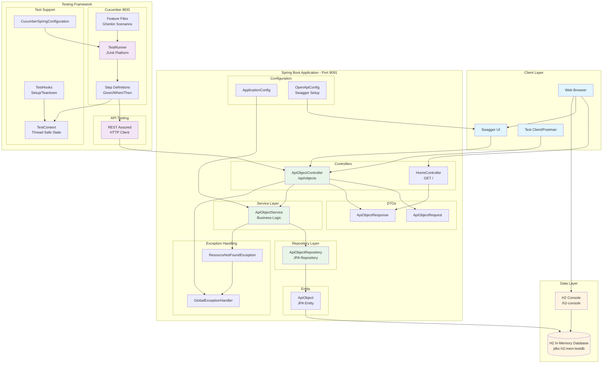
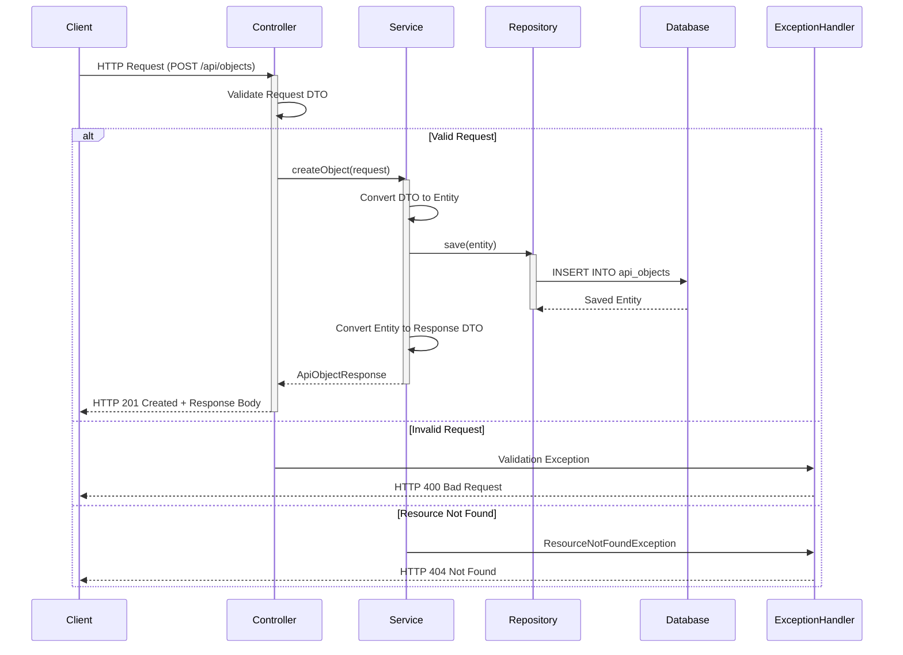
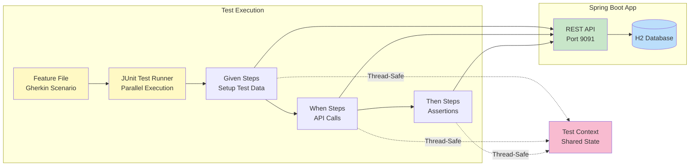
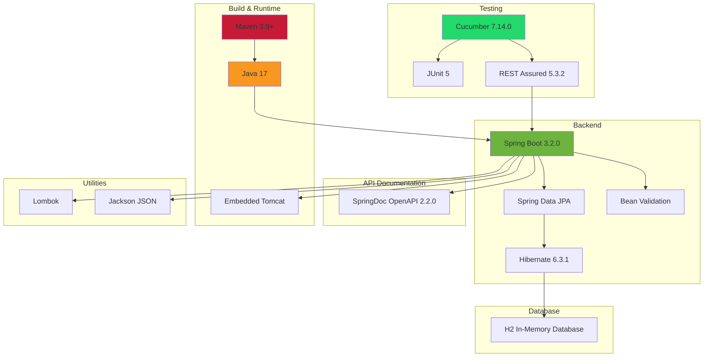
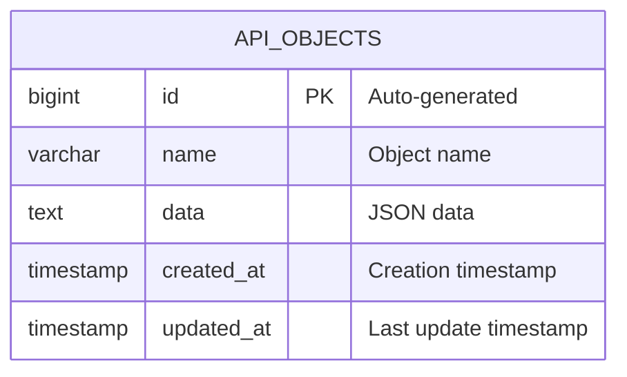

# Architecture Diagram

## System Architecture

```mermaid
graph TB
    subgraph Client["Client Layer"]
        Browser[Web Browser]
        SwaggerUI[Swagger UI]
        TestClient[Test Client/Postman]
    end

    subgraph App["Spring Boot Application - Port 9091"]
        subgraph Controllers
            HomeCtrl[HomeController<br>GET /]
            ApiCtrl[ApiObjectController<br>/api/objects]
        end

        subgraph Service["Service Layer"]
            ApiService[ApiObjectService<br>Business Logic]
        end

        subgraph Repo["Repository Layer"]
            ApiRepo[ApiObjectRepository<br>JPA Repository]
        end

        subgraph DTOs
            ReqDTO[ApiObjectRequest]
            ResDTO[ApiObjectResponse]
        end

        subgraph Entity
            EntityObj[ApiObject<br>JPA Entity]
        end

        subgraph Config["Configuration"]
            AppConfig[ApplicationConfig]
            OpenAPIConfig[OpenApiConfig<br>Swagger Setup]
        end

        subgraph Exception["Exception Handling"]
            GlobalEx[GlobalExceptionHandler]
            NotFoundEx[ResourceNotFoundException]
        end
    end

    subgraph Data["Data Layer"]
        H2DB[(H2 In-Memory Database<br>jdbc:h2:mem:testdb)]
        H2Console[H2 Console<br>/h2-console]
    end

    subgraph Testing["Testing Framework"]
        subgraph BDD["Cucumber BDD"]
            Features[Feature Files<br>Gherkin Scenarios]
            TestRunner[TestRunner<br>JUnit Platform]
            StepDefs[Step Definitions<br>Given/When/Then]
        end

        subgraph Support["Test Support"]
            TestContext[TestContext<br>Thread-Safe State]
            TestHooks[TestHooks<br>Setup/Teardown]
            CucumberConfig[CucumberSpringConfiguration]
        end

        subgraph APITest["API Testing"]
            RestAssured[REST Assured<br>HTTP Client]
        end
    end

    Browser --> HomeCtrl
    Browser --> SwaggerUI
    SwaggerUI --> ApiCtrl
    TestClient --> ApiCtrl

    HomeCtrl --> ResDTO
    ApiCtrl --> ReqDTO
    ApiCtrl --> ResDTO
    ApiCtrl --> ApiService
    ApiService --> ApiRepo
    ApiRepo --> EntityObj
    EntityObj --> H2DB

    ApiCtrl --> GlobalEx
    ApiService --> NotFoundEx
    NotFoundEx --> GlobalEx

    OpenAPIConfig --> SwaggerUI
    AppConfig --> ApiService

    Browser --> H2Console
    H2Console --> H2DB

    Features --> TestRunner
    TestRunner --> StepDefs
    StepDefs --> RestAssured
    RestAssured --> ApiCtrl
    StepDefs --> TestContext
    TestHooks --> TestContext
    CucumberConfig --> TestRunner

    style Browser fill:#e1f5ff
    style SwaggerUI fill:#e1f5ff
    style TestClient fill:#e1f5ff
    style H2DB fill:#fff4e1
    style H2Console fill:#fff4e1
    style ApiCtrl fill:#e8f5e9
    style ApiService fill:#e8f5e9
    style ApiRepo fill:#e8f5e9
    style TestRunner fill:#f3e5f5
    style RestAssured fill:#f3e5f5
```

## Component Flow Diagram

```mermaid
sequenceDiagram
    participant Client
    participant Controller
    participant Service
    participant Repository
    participant Database
    participant ExceptionHandler

    Client->>Controller: HTTP Request (POST /api/objects)
    activate Controller
    
    Controller->>Controller: Validate Request DTO
    
    alt Valid Request
        Controller->>Service: createObject(request)
        activate Service
        
        Service->>Service: Convert DTO to Entity
        Service->>Repository: save(entity)
        activate Repository
        
        Repository->>Database: INSERT INTO api_objects
        Database-->>Repository: Saved Entity
        deactivate Repository
        
        Service->>Service: Convert Entity to Response DTO
        Service-->>Controller: ApiObjectResponse
        deactivate Service
        
        Controller-->>Client: HTTP 201 Created + Response Body
        deactivate Controller
    else Invalid Request
        Controller->>ExceptionHandler: Validation Exception
        ExceptionHandler-->>Client: HTTP 400 Bad Request
    else Resource Not Found
        Service->>ExceptionHandler: ResourceNotFoundException
        ExceptionHandler-->>Client: HTTP 404 Not Found
    end
```

## Testing Flow

```mermaid
graph LR
    subgraph Execution["Test Execution"]
        Feature[Feature File<br>Gherkin Scenario]
        Runner[JUnit Test Runner<br>Parallel Execution]
        Given[Given Steps<br>Setup Test Data]
        When[When Steps<br>API Calls]
        Then[Then Steps<br>Assertions]
    end

    subgraph SpringApp["Spring Boot App"]
        API[REST API<br>Port 9091]
        DB[(H2 Database)]
    end

    Feature --> Runner
    Runner --> Given
    Given --> When
    When --> Then
    
    Given --> API
    When --> API
    Then --> API
    
    API --> DB
    
    Given -.Thread-Safe.-> TestCtx[Test Context<br>Shared State]
    When -.Thread-Safe.-> TestCtx
    Then -.Thread-Safe.-> TestCtx

    style Feature fill:#fff9c4
    style Runner fill:#fff9c4
    style API fill:#c8e6c9
    style DB fill:#bbdefb
    style TestCtx fill:#f8bbd0
```

## Technology Stack

```mermaid
graph TD
    subgraph "Backend"
        SpringBoot[Spring Boot 3.2.0]
        SpringData[Spring Data JPA]
        Hibernate[Hibernate 6.3.1]
        Validation[Bean Validation]
    end

    subgraph "Database"
        H2[H2 In-Memory Database]
    end

    subgraph "API Documentation"
        Swagger[SpringDoc OpenAPI 2.2.0]
    end

    subgraph "Testing"
        Cucumber[Cucumber 7.14.0]
        JUnit5[JUnit 5]
        RestAssured[REST Assured 5.3.2]
    end

    subgraph "Build & Runtime"
        Maven[Maven 3.9+]
        Java[Java 17]
        Tomcat[Embedded Tomcat]
    end

    subgraph "Utilities"
        Lombok[Lombok]
        Jackson[Jackson JSON]
    end

    SpringBoot --> SpringData
    SpringData --> Hibernate
    Hibernate --> H2
    SpringBoot --> Validation
    SpringBoot --> Swagger
    SpringBoot --> Tomcat
    SpringBoot --> Jackson
    SpringBoot --> Lombok

    Cucumber --> JUnit5
    Cucumber --> RestAssured
    RestAssured --> SpringBoot

    Maven --> Java
    Java --> SpringBoot

    style SpringBoot fill:#6db33f
    style Java fill:#f89820
    style Maven fill:#c71a36
    style Cucumber fill:#23d96c
```

## Data Model

```mermaid
erDiagram
    API_OBJECTS {
        bigint id PK "Auto-generated"
        varchar name "Object name"
        text data "JSON data"
        timestamp created_at "Creation timestamp"
        timestamp updated_at "Last update timestamp"
    }
```
